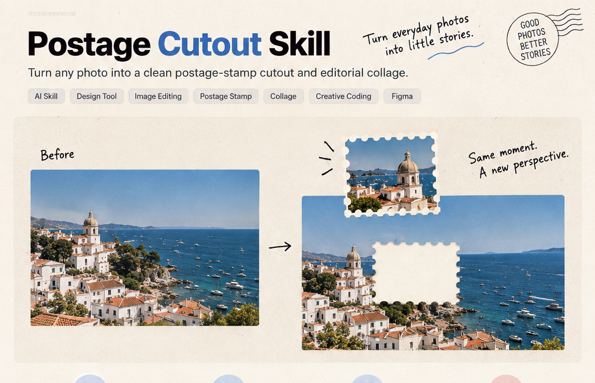
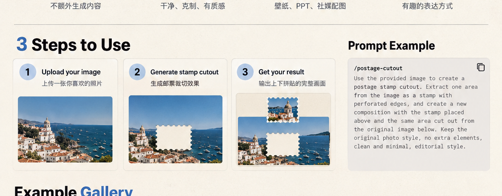
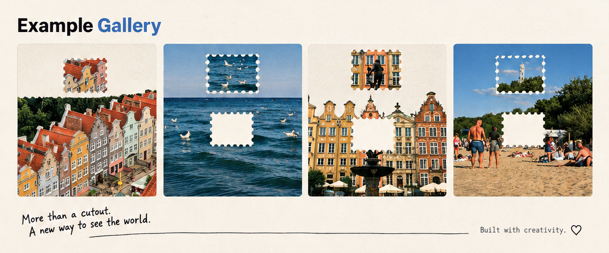

<div align="center">

# Postage Cutout Skill

Turn any photo into a clean postage-stamp cutout and editorial collage.

**Exact crop · clean perforation · matching negative space**




</div>

---

## What is this?

`Postage Cutout Skill` turns a photo into a **postage-shaped cutout**.

It is not the classic “white border + denomination + postmark” stamp look.

The default effect is:

- image fills the whole stamp shape;
- evenly spaced inward semicircle perforations on all four edges;
- warm cream paper background;
- one exact crop is extracted from the source image;
- the same region remains as a matching stamp-shaped hole below;
- subtle analog grain and soft shadow;
- no extra text, postmark, or decoration by default.

> **Core rule:** the stamp above must be the exact crop removed from the original image below.

---

# Quick Start

## 1. Add the Skill

Download this repository and add / load `SKILL.md` into an AI tool or Agent that supports custom Skills or instruction files.

If your tool supports a Skills folder, place this repository there.  
If it only supports custom instructions, use the contents of `SKILL.md` as the instruction.

## 2. Upload an image

Use a photo, poster, architecture shot, landscape, UI visual, or any image with a clear focal area.

## 3. Say one sentence

### First use

To make the intent completely explicit the first time, you can say:

> **使用 Postage Cutout Skill，把这张照片变成邮票形状。**

> **Use the Postage Cutout Skill to turn this photo into a postage stamp shape.**

### After the Skill is loaded

You do **not** need to mention the Skill name every time.  
Just use a natural instruction:

### 中文示例

> **把这张照片变成邮票形状。**

> **把图里的一个局部提取成邮票，并在原图里留下对应的镂空区域。**

> **把这张图做成邮票裁切拼贴效果。**

### English examples

> **Turn this photo into a postage stamp shape.**

> **Extract one area as a stamp and leave the matching cutout in the original image.**

> **Turn this image into a postage cutout collage.**

---

## How it works



The Skill follows one simple visual logic:

```text
SOURCE IMAGE
     ↓
SELECT ONE REGION
     ↓
CUT IT INTO A STAMP SHAPE
     ↓
MOVE THE EXACT CROP UP
     ↓
LEAVE THE SAME SHAPED HOLE BELOW
```

This keeps the result visually believable and prevents the model from inventing a different scene inside the stamp.

---

## Prompt Example

### Poster mode

```text
Preserve the uploaded image exactly.

Create a 1080×1440 editorial collage on a warm cream textured paper background.
Place the original image full width across the lower ~51% of the canvas.

Select one visually strong rectangular region from that lower image,
approximately 3:2, and cut it out using a clean postage-stamp silhouette
made of evenly spaced inward semicircular perforation bites on all four edges.

Move that exact extracted crop to the upper half, centered horizontally,
keeping the source pixels, colors, objects, perspective, and details unchanged.

The removed region in the lower image must become the same stamp-shaped
cream-paper negative space.

No white frame around the stamp.
Add only a very subtle soft shadow under the upper stamp.
Do not add text, postmarks, borders, objects, people, or decorative elements.

The top stamp must be the exact same crop that is missing from the lower image.
```

### Stamp-only mode

```text
Preserve the uploaded image exactly and crop it into a horizontal 3:2
postage-stamp silhouette.

Use evenly spaced inward semicircular perforation bites on all four edges.
The photo must run to the edge of the stamp shape with no white border,
no text, no postmark, and no added illustration.

Transparent background outside the stamp shape.
```

---

## Example Gallery



Works especially well with:

| Source | Why |
|---|---|
| Architecture | Details stay readable at small size |
| Seaside / water | Large color blocks make the stamp edge obvious |
| Travel photography | Feels like a visual souvenir |
| Landmarks | One iconic detail becomes a strong focal point |
| Editorial imagery | Negative space becomes part of the composition |

---

## Modes

### `poster`

Default editorial collage:

- 1080 × 1440
- cream paper background
- extracted stamp above
- original image below
- matching stamp-shaped hole

### `stamp`

Standalone stamp asset:

- transparent background
- no white border
- no postmark
- no text
- source image preserved

### `classic-stamp`

Only when explicitly requested:

- outer border
- denomination
- country label
- optional postmark

---

## Deterministic Helper

For maximum consistency, this repository includes a small Python helper.

```bash
pip install -r requirements.txt
python scripts/postage_cutout.py input.jpg output.png
```

Choose the crop focus:

```bash
python scripts/postage_cutout.py input.jpg output.png \
  --focus-x 0.50 \
  --focus-y 0.55
```

Create only the transparent stamp:

```bash
python scripts/postage_cutout.py input.jpg stamp.png --mode stamp
```

---

## Repository Structure

```text
postage-cutout-skill/
├── README.md
├── SKILL.md
├── LICENSE
├── requirements.txt
├── assets/
│   ├── postage-mask.svg
│   └── readme/
│       ├── hero.png
│       ├── steps-and-prompt.png
│       ├── gallery.png
│       └── social-preview.png
├── scripts/
│   └── postage_cutout.py
└── examples/
    └── README.md
```

---

## Design Rules

**Do**

- keep the crop exact;
- use even semicircular perforations;
- preserve the source image;
- keep architecture, faces, people, signs, colors, and perspective unchanged;
- keep paper texture subtle;
- keep shadow light.

**Don't**

- regenerate a different scene inside the stamp;
- add random torn-paper edges;
- add a white border unless requested;
- add denomination or postmark by default;
- change faces, objects, buildings, windows, or signage;
- overdo grain, sepia, distressing, or shadow.

---

## GitHub Setup

Recommended repository name:

```text
postage-cutout-skill
```

Recommended description:

```text
Turn any photo into a clean postage-stamp cutout and editorial collage.
```

Recommended Topics:

```text
ai-skill
design-skill
image-editing
postage-cutout
collage
creative-coding
figma
image-processing
```

For **Social preview**, upload:

```text
assets/readme/social-preview.png
```

---

## License

The Skill text, SVG mask, generated README demo artwork, and helper script are released under the **MIT License**.

Do not add third-party photography to this repository unless you have permission to redistribute it.

---

<div align="center">

**Good photos. Better stories.**

If this Skill helps your workflow, consider starring the repo ⭐

</div>
